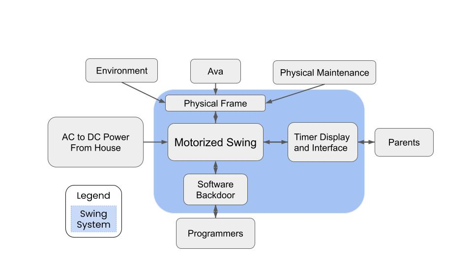
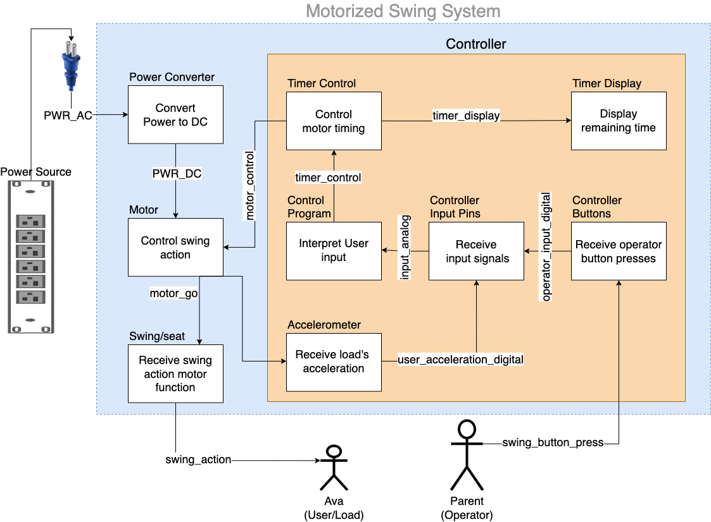

# ElectroSwing
Codebase for the control portion of our system, "Ava's Motorized Swing".

Our control system consists of a timer interface that 
allows Ava's parents to set and stop the swing operation time.

<figure>
    
    <figcaption>Fig 1. System Boundary Diagram (SBD)</figcaption>
</figure>

<figure>
    
    <figcaption>
        Fig 2. Data Flow Diagram (DFD). 
        This Repo contains the software for the controller (orange) portion.
    </figcaption>
</figure>

## Build instructions
TODO: fill this in. i.e. Use the arduino IDE and run `primary.ino`

## Directories
### ./main
Source files.

### ./reference_code
This project contains a lot of iterative design ideas, 
particularly for the motor and timer functionality.
To keep that legacy, some of that has been stored in this folder.

It also contains some source code that we got from arduino documentation 
and other open source projects.